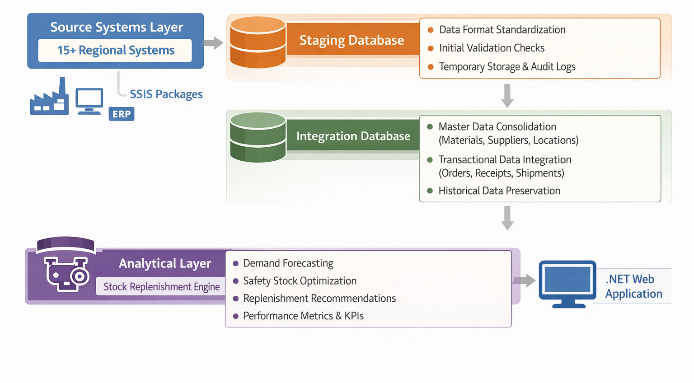
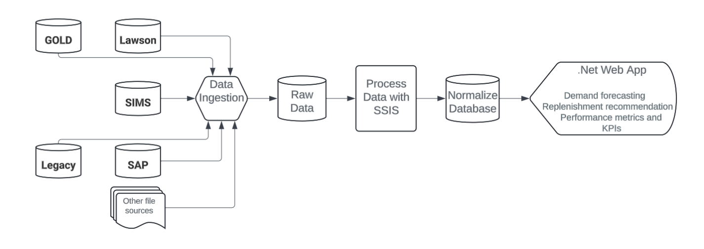

# Supply Chain Analytics & Stock Replenishment Optimization for Global Oil & Gas Services

!!! abstract "Case Study Summary" 
    **Client:** Global Oil & Gas Services Organization
    **Industry:** Oil & Gas Services, Energy Technology  
    **Engagement Duration:** 12+ Months  
    **Role:** Senior ETL Developer  
    **Team Size:** 6–10 (Data Engineers, Frontend Developers, Business Analysts)
    
    **Impact Metrics**:

    - **Optimized inventory across 50+ global distribution centers** serving oil field operations  
    - **$2M+ annual savings** through reduced stockouts and excess inventory  
    - **70% reduction in manual planning time** through automated replenishment calculations  
    - **Consolidated data from 15+ regional systems** into unified supply chain platform  
    - **Enabled real-time inventory visibility** for 200+ distribution center planners  
    - **99.5% on-time delivery** improved through predictive stock level management  
    - **30% reduction in expedited shipping costs** through better demand forecasting  

    We aimed to reduce duplication of data, provide real time inventory visibility to the warehouse managers, that can help them to update the stock level at near to real time thresholds.

---

## Business Problem

The organization operated a complex global supply chain supporting critical oilfield operations across multiple continents, requiring precise inventory management for thousands of specialized parts and materials.

**Key Challenges:**

### **Fragmented Inventory Systems**
- **15+ regional source systems** (GOLD, Lawson, SWPS, SAP, and legacy systems)  
- Each geography maintaining separate inventory, orders, and supplier data  
- No unified view of global stock levels across distribution centers  
- Inconsistent part numbering and product definitions  

### **Manual Replenishment Planning**
- **Excel-based planning tools** requiring extensive manual updates  
- Planners spending 60%+ of time on data collection vs. strategic analysis  
- Error-prone manual calculations leading to stockouts or overstock situations  
- Inability to respond quickly to changing demand patterns  

### **Supply Chain Inefficiencies**  
- **Stockouts causing operational delays** at critical oilfield sites  
- **Excess inventory tying up working capital** (millions in slow-moving stock)  
- **High expedited shipping costs** due to poor demand visibility  
- Lack of predictive analytics for seasonal or project-driven demand spikes  

### **Decision-Making Limitations**  
- No real-time visibility into supplier performance  
- Inability to optimize safety stock levels scientifically  
- Limited insights into cross-location inventory balancing opportunities  

---

## Our Approach

Delivered a **modern ETL framework and data platform** that unified fragmented supply chain data, automated replenishment calculations, and enabled intelligent inventory optimization across the global distribution network.
### **1. Enterprise Data Integration Architecture**  

{ .full-width }  

**Multi-Source Data Consolidation:**  
  - **Integration of 15+ source systems** with varying data formats and frequencies  
  - **GOLD System:** Primary materials management (daily updates)  
  - **Lawson ERP:** Financial and procurement data (daily updates)  
  - **SWPS:** Regional warehouse management (real-time)  
  - **SAP:** European operations (daily batch)  
  - **Legacy systems:** Custom databases at remote locations (varied schedules)  

### **2. Advanced ETL Framework Development**  

**Organization's ETL Framework Implementation:**  
- **Custom-built enterprise ETL framework** with reusable components  
- **Built-in capabilities:**  
  - Error handling and exception management  
  - Execution logging and auditing  
  - Package dependency management  
  - Automatic sequencing and orchestration  
  - Email notifications for failures  

**SSIS Package Suite (60+ packages):**  
- **Full load packages** for dimension tables (materials, suppliers, locations)  
- **Incremental load packages** for transactional data (orders, receipts, inventory movements)  
- **Complex transformation logic:**  
  - Part number standardization across systems  
  - Unit of measure conversions  
  - Currency normalization for cost analysis  
  - Data quality validations and cleansing  

**Load Strategies by Source:**  
```sql  
-- Daily Systems (GOLD, SAP, Lawson)  
- Incremental load based on last modified timestamps  
- Change data capture for updated records  
- Historical snapshots for trending analysis  

-- Real-time Systems (SWPS)
- Near real-time micro-batches  
- Event-driven triggers for critical updates  
- Continuous validation against source  
```

### **3. Data Normalization & Master Data Management**

**Challenges Resolved:**  
- **Material master consolidation:** 100,000+ parts from different nomenclatures unified  
- **Supplier rationalization:** Deduplicated 5,000+ supplier records across regions  
- **Location hierarchy:** Standardized 50+ distribution center definitions  
- **Cross-reference tables:** Mapped regional part numbers to global standards  

**Data Quality Improvements:**  
- Implemented business rules engine for validation  
- Automated data profiling and quality scoring  
- Exception handling with business stakeholder workflows  

### **4. Stock Replenishment Analytics Engine**  

**Intelligent Algorithms:**  
- **Demand forecasting:** Historical consumption patterns with seasonality adjustments  
- **Lead time analysis:** Dynamic calculations based on supplier and shipping route performance  
- **Safety stock optimization:** Statistical models balancing service levels vs. holding costs  
- **Reorder point calculations:** Automated recommendations factoring demand variability  
- **Min/Max inventory levels:** Dynamically adjusted based on trends  

**Planner Decision Support:**  
- **Role-based views** for 200+ distribution center planners  
- **Exception alerts** for stockouts, overstock, slow-moving inventory  
- **What-if scenario planning** for demand spikes or supplier issues  
- **Approval workflows** for high-value replenishment orders  

---

## Results & Impact

### **Operational Excellence**  
- **70% reduction** in manual data collection and preparation time  
- **Planners shifted from data gathering to strategic analysis** and supplier negotiations  
- **Near real-time inventory visibility** replacing day-old data  

### **Financial Impact**
- **$2M+ annual savings** through optimized inventory levels  
  - Reduced stockouts: $800K saved in expedited shipping  
  - Reduced excess inventory: $1.2M freed up working capital  
- **30% reduction** in expedited freight costs  
- **15% improvement** in inventory turnover ratio  

### **Supply Chain Performance**  
- **99.5% on-time delivery** to oilfield operations (up from 92%)  
- **35% reduction** in emergency orders  
- **Improved service levels** without increasing inventory investment  

### **Data Quality & Trust**  
- **99.8% data accuracy** through automated validation  
- **Eliminated regional data silos** enabling global optimization  
- **Single source of truth** for inventory and supply chain analytics  

### **Scalability Achieved**  
- Platform handling **10M+ transactions annually**  
- Supporting **50+ distribution centers** across 4 continents  
- Flexible architecture accommodating new source systems  

---

## Technical Solution

### **Architecture Overview**
{ .full-width }  

**Key Technical Features:**  

**1. Dynamic Package Execution:**  
```
- Framework-driven execution eliminates hard-coded dependencies  
- Packages self-register with metadata tables  
- Automatic retry logic for transient failures  
- Parallel processing for independent data streams  
```

**2. Comprehensive Error Handling:**  
```
- Try-catch blocks at each transformation step  
- Business rule violations captured separately from technical errors  
- Automatic rollback on critical failures  
- Detailed error logging with data lineage  
```

**3. Performance Optimization:**
```sql  
-- Partitioned staging tables for fast loads
CREATE TABLE StagingOrders  
PARTITION BY RANGE (OrderDate);  

-- Bulk insert optimization
BULK INSERT with TABLOCK and ORDER hints  

-- Parallel processing for large datasets
Multiple SSIS packages running concurrently  

-- Index strategy
Clustered indexes on primary keys  
Non-clustered indexes on frequent query filters  
```

---

## Tech Stack

### **Data Integration Platform**  
- **SQL Server 2014** (Staging and Integration databases)  
- **SQL Server Integration Services (SSIS)** (30+ ETL packages)  
- **Team Foundation Server (TFS)** (Source control & CI/CD)  

### **Source Systems**  
- **GOLD** (Materials management system)  
- **Lawson ERP** (Financial and procurement)  
- **SWPS** (Warehouse management)  
- **SAP** (European operations)  
- **Custom databases** (Regional legacy systems)  

### **ETL Framework**  
- **Organization's Custom ETL Framework** (Proprietary accelerator)  
- **T-SQL** (Complex transformations and validations)  
- **PowerShell** (Automation scripts)  

### **Frontend Integration**  
- **Web-based Stock Replenishment Tool** (consuming data via APIs)  
- **Role-based access** for distribution center planners  

### **Development & Operations**  
- **Visual Studio (SSDT)** for SSIS development  
- **TFS** for version control and deployment  
- **SQL Server Agent** for job scheduling  
- **Custom monitoring dashboard** for ETL health   

---

## Key Technical Innovations

### **1. Adaptive Load Frequencies**  
- Different load schedules based on source system criticality  
- Real-time for SWPS warehouse movements  
- Daily for transactional systems  
- Weekly for reference data  

### **2. Data Reconciliation Framework**  
```sql  
-- Automated reconciliation checks  
- Source system row counts vs. loaded records  
- Sum of order values validation  
- Cross-system consistency checks  
- Historical trend anomaly detection  
```

### **3. Configuration-Driven Processing**  
- All ETL parameters externalized in configuration tables  
- No hard-coded values enabling easy maintenance  
- Dynamic handling of new source systems  

### **4. Intelligent Dependency Management**  
- Framework automatically determines execution order  
- Parallel execution where possible  
- Automatic sequencing for dependent packages  

---

## Key Deliverables

✅ **30+ SSIS ETL Packages** with framework integration  
✅ **Organization's ETL Framework** implementation and customization  
✅ **Normalized integration database** (star schema design)  
✅ **Data quality validation suite** with 100+ rules  
✅ **Technical documentation** (architecture, ETL specs, data dictionary)  
✅ **Deployment automation** via TFS and PowerShell scripts  
✅ **Monitoring dashboard** for ETL performance and data quality  
✅ **Knowledge transfer** to support and operations teams

---

## Project Challenges & Solutions  
  
### **Challenge 1: Inconsistent Part Numbering**  
**Solution:** Built cross-reference tables mapping regional part numbers to global master data, with fuzzy matching algorithms for similar descriptions.

### **Challenge 2: Varying Source System Availability**
**Solution:** Implemented retry logic with exponential backoff and graceful degradation when systems unavailable.

### **Challenge 3: Complex Business Rules**
**Solution:** Externalized business rules in configuration tables, enabling business stakeholder updates without code changes.

### **Challenge 4: Performance at Scale**
**Solution:** Partitioning, indexing strategy, and parallel processing reducing load times by 60%.

---

## Lessons Learned & Best Practices

### **What Worked Well**  
1. **Framework-driven approach** significantly reduced development time  
2. **Incremental delivery** allowed early value realization  
3. **Close collaboration with planners** ensured usability  
4. **Comprehensive testing** prevented production issues  

### **Key Success Factors**  
- Reusable framework components accelerated delivery  
- Strong data governance ensuring quality  
- Flexible architecture accommodating evolving requirements  
- Proactive performance monitoring  

---

## Future Enhancements  

### **Roadmap**
- **Machine learning models** for demand forecasting
- **Migration to Azure Data Factory** for cloud scalability  
- **Power BI dashboards** for executive visibility  
- **IoT integration** for real-time equipment usage triggering replenishment  
- **Supplier collaboration portal** for real-time inventory visibility  

---

## Client Testimonial

> *"The stock replenishment solution transformed our supply chain operations. We now have real-time visibility into inventory across all locations, enabling smarter decisions that have saved millions while improving service levels. The automated ETL processes have freed our planners to focus on strategic relationships and exception management rather than data chasing."*
> 
> — **Director, Global Supply Chain Operations**

---

## About This Project

**Duration:** 12+ months (initial delivery + enhancements)  
**Methodology:** Agile with 4-week sprints  
**Deployment:** Phased rollout by region  
**Support Model:** 24/7 support for critical supply chain operations

---

**Tags:** #SupplyChain #InventoryOptimization #ETL #SSIS #DataIntegration #OilAndGas #StockReplenishment #DataWarehouse #EnterpriseData